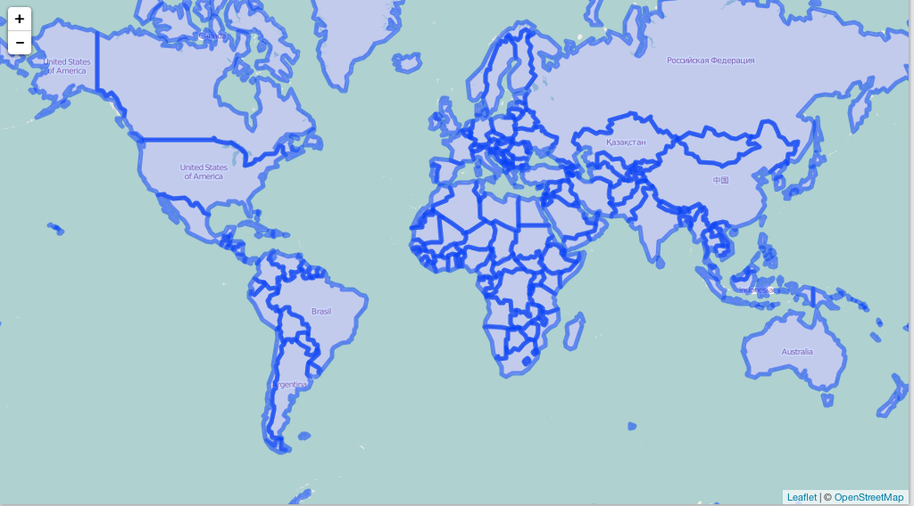

geopeasy
========

`geopeasy`

[geojson-xyz](https://github.com/geojson-xyz/geojson-xyz) inspired

## Install

```{r eval=FALSE}
install.packages("devtools")
devtools::install_github("sckott/geopeasy")
```

```{r}
library("geopeasy")
```

```{r eval=FALSE}
peasy(query = "political")

#> Select one:
#> 1: countries
#> 2: states
#> 3: boundaries
#> 4: other
#>
#> Selection: 1
#>
#> Select one:
#> 1: ne_50m_admin_0_tiny_countries.zip
#> 2: ne_50m_admin_0_tiny_countries_scale_rank.zip
#> 3: ne_110m_admin_0_countries.zip
#> 4: ne_10m_admin_0_countries.zip
#> 5: ne_10m_admin_0_countries_lakes.zip
#> 6: ne_110m_admin_0_countries_lakes.zip
#> 7: ne_50m_admin_0_countries.zip
#> 8: ne_110m_admin_0_tiny_countries.zip
#> 9: ne_50m_admin_0_countries_lakes.zip
#>
#> Selection: 3
```



## Meta

* Please note that this project is released with a [Contributor Code of Conduct](CONDUCT.md). By participating in this project you agree to abide by its terms.
